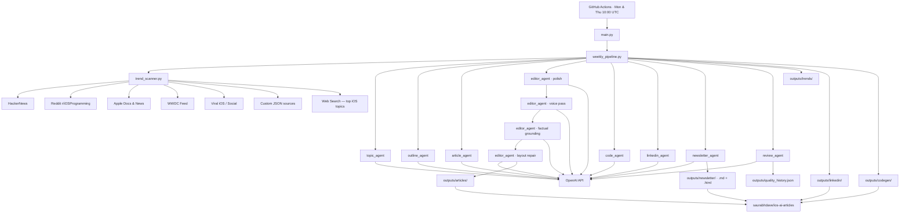

# ios-dev-ai-writer

> Automated Apple-platform engineering articles, Swift code examples, LinkedIn posts, and a developer newsletter — generated by a multi-stage LLM pipeline and published on a schedule.

[](CHANGELOG.md)
[](https://www.python.org)
[](https://platform.openai.com)
[](LICENSE)
[](https://github.com/saurabhdave/ios-dev-ai-writer/actions)

---

## What It Does

Twice a week (daily during the WWDC window), a GitHub Actions job scans iOS/Swift trend sources, picks a topic, and runs it through a multi-stage LLM pipeline that produces a full Medium-style article — complete with a Swift code example, a LinkedIn post, and a developer newsletter issue. Everything is committed and published automatically.

**Published output lives at [saurabhdave/ios-ai-articles](https://github.com/saurabhdave/ios-ai-articles).**

---

<!-- PIPELINE_HEALTH_START -->
## Pipeline Health

_Auto-generated from `outputs/quality_history.json` and `memory/family_picks.json` by `scripts/update_readme.py`._

| Metric | Value |
|---|---|
| Total runs | 56 (2026-03-13 → 2026-06-12) |
| Codegen success (last 10) | 90% — 4 direct, 5 repaired, 1 omitted |
| Avg review score (last 10) | 8.3 / 10 |
| Cross-platform topics (last 8) | 4 of 8 mention non-iOS Apple platforms |
| Zero-coverage families (last 8) | 2 of 8 — `swiftui_features, migration` |

**Recent topic-family rotation (newest first):** wwdc_event → accessibility_design → tooling_debugging → architecture → concurrency → accessibility_design → frameworks_apis → performance

<!-- PIPELINE_HEALTH_END -->

---

## Pipeline

```
Trend Scanner (8 sources)
    │
    ▼
Topic Agent ──► dedup check (embedding similarity + theme cluster guard)
    │
    ▼
Outline Agent
    │
    ▼
Article Agent (~900–1,200 words, 5-section Medium structure)
    │
    ▼
Editor Pass ──► Voice Pass ──► Factual Grounding ──► Layout Repair loop
    │
    ├──► Code Agent (Swift 6.2.4, snippet validation + repair loop)
    ├──► LinkedIn Agent (senior-voice post, claim guardrails)
    ├──► Newsletter Agent (6-section SwiftTribune-style, Markdown + HTML)
    └──► Review Agent (quality scores → repair trigger if below threshold)
    │
    ▼
Auto-commit to ios-ai-articles
```

---

## Architecture



---

## Features

### Content Quality
| Feature | Detail |
|---|---|
| **Editor pass** | Polish for clarity, tone, and Medium readability |
| **Voice pass** | Strips AI writing patterns — "Choose X/Z" constructs, hedge phrases, passive recommendations, vague claims |
| **Factual grounding** | Conservative rewrite pass to reduce hallucinated claims |
| **Reference-content grounding** | Fetches trusted reference pages and injects text excerpts into the article + grounding prompts, so timely topics are grounded in real source content instead of titles alone |
| **Inline snippet validation** | Fenced `swift` blocks in the article body get the deterministic `@Bindable` fix plus a syntax-only parse check; issues are logged and recorded in quality history |
| **Layout repair loop** | Iteratively scores article against a 15-point Medium rubric — including a required inline `swift` snippet in the body — and repairs until score ≥ threshold |
| **Deterministic repair** | Post-process fixes malformed backticks, strips `Operational note:` template artifacts, and inserts a standard iOS/Swift baseline note after the intro |
| **Self-review** | LLM scores each article on overall quality, technical depth, and actionability |
| **Review-triggered repair** | Re-runs editor pass when review score falls below threshold |

### Topic Discovery
| Feature | Detail |
|---|---|
| **8 trend sources** | HackerNews, Reddit, Apple Docs, WWDC, viral/social, platforms, custom JSON, web search — fetched concurrently; HackerNews uses a single Algolia API request |
| **Embedding dedup** | `text-embedding-3-small` cosine similarity catches near-duplicate topics with low lexical overlap |
| **Theme cluster guard** | Hard limit on same-cluster articles (Swift concurrency, UIKit migration, SwiftUI profiling) per rolling window |
| **Apple-platform only** | Topics filtered to iOS/Swift/SwiftUI/Xcode — AI-first subjects excluded via a shared filter (`utils/content_filters.py`) used by scanner, pipeline, and topic agent |
| **WWDC mode** | Inside the yearly `WWDC_START_DATE`..`WWDC_END_DATE` window the pipeline runs daily, suspends the family rotation, and covers a different announcement angle each day (keynote, SwiftUI, Swift/concurrency, tooling, platforms, Apple Intelligence) |

### Code Generation
| Feature | Detail |
|---|---|
| **Swift 6 first** | `@Observable` preferred; targets Swift 6.2.4, compiler mode 6 by default |
| **Validation modes** | `snippet` (syntax + placeholder check), `compile` (strict typecheck), `none` |
| **Repair loop** | Up to N attempts to fix failing snippets before falling back to `omit` or `error` |
| **Codegen metadata** | Per-run JSON with path (`direct`/`repaired`/`omitted`) and repair attempt count |

### Output & Automation
| Feature | Detail |
|---|---|
| **LinkedIn post** | Senior-voice post with code snippet (auto/always/never) and claim guardrails |
| **Newsletter** | 6-section SwiftTribune issue — Markdown + email-safe inline-styled HTML, auto-incrementing issue number |
| **Quality history** | `outputs/quality_history.json` accumulates layout scores, review scores, and repair counts across all runs |
| **Structured logging** | JSON log lines with agent name, token usage, step timing, and status — readable in GitHub Actions |
| **URL safety** | Unverified URLs stripped from article body before publication |
| **Reference quality check** | Homepage-level reference URLs (e.g. `developer.apple.com/documentation/swiftui`) flagged with a `WARNING` log event; prompt enforces specific page links, SE proposal citations, and WWDC session citations |
| **Author context injection** | Articles grounded in your real production experience via `scanners/author_context.json` — failure modes, device-specific observations, and migration gotchas injected per topic family |

---

## Project Structure

```
ios-dev-ai-writer/
├── agents/
│   ├── topic_agent.py          # topic selection + dedup
│   ├── outline_agent.py
│   ├── article_agent.py
│   ├── editor_agent.py         # polish → voice → factual grounding → layout repair
│   ├── code_agent.py           # Swift codegen + validation loop
│   ├── linkedin_agent.py
│   ├── newsletter_agent.py
│   └── review_agent.py
├── scanners/
│   ├── trend_scanner.py        # 8-source trend aggregation → TrendSignal
│   ├── custom_trends.json
│   └── author_context.json     # your real-world experience bullets per topic family
├── workflows/
│   └── weekly_pipeline.py      # main orchestrator
├── prompts/                    # all LLM prompt templates
├── scripts/
│   ├── update_readme.py        # regenerates the Pipeline Health README block
│   └── health_check.py         # post-run health-regression check → CI issue
├── utils/
│   ├── article_repair.py       # deterministic post-processing for article cleanup
│   ├── content_filters.py      # shared AI-exclusion patterns + Apple Intelligence allowlist
│   ├── reference_content.py    # fetches reference pages → prompt-ready text excerpts
│   ├── observability.py        # structured JSON logging
│   └── openai_logging.py       # OpenAI client + token tracking
├── tests/                      # unittest suite: OpenAI config, trend scanner/discovery,
│                               # content filters, layout rubric, health check, dedup auth
├── outputs/                    # gitignored — published to ios-ai-articles
├── .github/
│   ├── dependabot.yml          # weekly pip + github-actions updates
│   └── workflows/
│       ├── weekly.yml          # scheduled pipeline
│       └── release.yml         # GitHub Release on v* tag
├── config.py                   # all env-var configuration
└── main.py
```

---

## Setup

**Requirements:** Python 3.11, an OpenAI API key.

```bash
# 1. Clone and install
git clone https://github.com/saurabhdave/ios-dev-ai-writer.git
cd ios-dev-ai-writer
pip install -e .

# 2. Configure
cp .env.example .env
# Set OPENAI_API_KEY at minimum

# 3. Run
python main.py
```

---

## Personalising the Output

The pipeline can ground articles in your real iOS engineering experience via `scanners/author_context.json`. When the generated topic matches a known family (e.g. concurrency, SwiftUI rendering), those bullets are injected into the article prompt so the output references your specific failure modes and production observations — not a generic senior-engineer persona.

### How to fill it in

Open `scanners/author_context.json` and add 2–3 first-person bullet points per topic family you have experience with:

```json
{
  "concurrency": [
    "Migrated a URLSession-heavy networking layer to async/await — cancellation semantics were the main gotcha",
    "Hit data races in a shared cache when moving to Swift 6 strict concurrency"
  ],
  "swiftui_rendering": [
    "Profiled a feed view re-rendering 3x per scroll tick — root cause was @Observable held by multiple ancestor views"
  ],
  "architecture": [],
  "testing": [],
  "performance": [],
  "migration": []
}
```

**Guidelines:**
- Write in first person and be specific — device names, API names, failure conditions
- Include at least one failure mode per family ("This broke when…", "We hit this under…")
- Leave a family as `[]` if you have no direct experience — the prompt falls back to a generic senior-engineer voice
- The `_instructions` key is ignored by the pipeline; it's a reminder for you

**Topic families and their keywords:**

| Family | Matched when topic contains |
|---|---|
| `concurrency` | async, await, actor, task, concurrency, combine |
| `swiftui_rendering` | render, swiftui, instruments, profil, body, view |
| `architecture` | architecture, pattern, design, injection, dependency |
| `testing` | test, xctest, mock, stub, tdd |
| `performance` | performance, memory, cpu, battery, optimis |
| `migration` | migrat, urlsession, uikit, legacy, deprecated |

---

## Configuration

All settings are driven by environment variables. Set them in `.env` or export directly.

### Core

| Variable | Default | Description |
|---|---|---|
| `OPENAI_API_KEY` | — | **Required** |
| `OPENAI_MODEL` | `gpt-5-mini` | Model for all pipeline stages |
| `OPENAI_TEMPERATURE` | `0.7` | Global temperature cap |
| `OPENAI_REASONING_EFFORT` | model-aware | `none`\|`minimal`\|`low`\|`medium`\|`high`\|`xhigh` — used for GPT-5 and o-series models. `gpt-5.1` defaults to `none`; `temperature` is only sent for `gpt-5.1` when reasoning is `none`. |

### Content Quality

| Variable | Default | Description |
|---|---|---|
| `EDITOR_PASS_ENABLED` | `true` | Polish for clarity, tone, readability |
| `VOICE_PASS_ENABLED` | `true` | Remove AI writing fingerprints from prose |
| `FACT_GROUNDING_ENABLED` | `true` | Conservative factual rewrite pass |
| `FACT_GROUNDING_MAX_PASSES` | `1` | Max factual grounding iterations |
| `MEDIUM_LAYOUT_REINFORCEMENT_ENABLED` | `true` | Iterative layout repair loop |
| `MEDIUM_LAYOUT_MAX_REPAIR_PASSES` | `2` | Max layout repair iterations |
| `MEDIUM_LAYOUT_MIN_SCORE` | `8` | Minimum passing layout score (out of 15) |
| `REFERENCE_CONTENT_ENABLED` | `true` | Fetch reference pages and inject text excerpts into article + grounding prompts |
| `REFERENCE_CONTENT_MAX_PAGES` | `3` | Max reference pages whose excerpts are injected per run |
| `REFERENCE_CONTENT_MAX_CHARS` | `1500` | Max excerpt characters per page |
| `SELF_REVIEW_ENABLED` | `true` | LLM self-review scoring pass |
| `REVIEW_REPAIR_ENABLED` | `true` | Re-run editor pass if review score is low |
| `REVIEW_REPAIR_MIN_SCORE` | `7` | Score threshold that triggers repair |

### Trend Discovery

| Variable | Default | Description |
|---|---|---|
| `TREND_DISCOVERY_ENABLED` | `true` | Enable multi-source trend scanning |
| `TREND_SOURCES` | *(all 8)* | Comma-separated: `hackernews,reddit,apple,wwdc,viral,social,platforms,custom,websearch` |
| `TREND_MAX_ITEMS_PER_SOURCE` | `10` | Items fetched per source |
| `TREND_HTTP_TIMEOUT_SECONDS` | `12` | HTTP timeout for trend fetches |
| `TREND_FETCH_MAX_WORKERS` | `8` | Concurrent source fetchers during trend discovery (`1` = sequential) |
| `REDDIT_USER_AGENT` | `ios-dev-ai-writer/1.0 (weekly trend scanner)` | User-agent string for Reddit RSS requests |
| `CUSTOM_TRENDS_FILE` | `scanners/custom_trends.json` | Path to custom trends JSON |
| `TOPIC_INTERESTS` | *(19 topics — see config.py)* | Comma-separated list of preferred topic areas fed to the topic agent |
| `TOPIC_SIMILARITY_THRESHOLD` | `0.72` | Cosine similarity threshold above which a candidate topic is rejected as a semantic near-duplicate |
| `WWDC_START_DATE` | *(unset — set yearly in `weekly.yml`)* | First day of the WWDC window (`YYYY-MM-DD`); enables WWDC mode together with `WWDC_END_DATE` |
| `WWDC_END_DATE` | *(unset — set yearly in `weekly.yml`)* | Last day of the WWDC window (`YYYY-MM-DD`, inclusive) |

### Code Generation

| Variable | Default | Description |
|---|---|---|
| `SWIFT_LANGUAGE_VERSION` | `6.2.4` | Target Swift release |
| `SWIFT_COMPILER_LANGUAGE_MODE` | `6` | Maps to `swiftc -swift-version` |
| `CODEGEN_VALIDATION_MODE` | `snippet` | `snippet`\|`compile`\|`none` |
| `CODEGEN_FAILURE_MODE` | `omit` | `omit` (publish without code) \| `error` (fail pipeline) |

### Output

| Variable | Default | Description |
|---|---|---|
| `LINKEDIN_POST_ENABLED` | `true` | Generate LinkedIn post |
| `LINKEDIN_CODE_SNIPPET_MODE` | `auto` | `auto`\|`always`\|`never` |
| `NEWSLETTER_ENABLED` | `true` | Generate newsletter issue |
| `NEWSLETTER_NAME` | `iOS Dev Weekly` | Newsletter display name |
| `OUTPUT_QUALITY_HISTORY_PATH` | `outputs/quality_history.json` | Append-only quality record |
| `CROSS_REPO_DEDUP_ENABLED` | `true` | Fetch published titles from the output repo via GitHub API to guard against state drift |
| `PUBLISHED_REPO_API_URL` | *(ios-ai-articles articles API)* | GitHub Contents API URL used for cross-repo dedup |
| `GITHUB_TOKEN` | *(unset)* | Optional — authenticates the cross-repo dedup API call (avoids the 60/hr unauthenticated rate limit). CI passes the built-in Actions token automatically |

### Pipeline Health Thresholds

Read by `scripts/health_check.py` after each run. A trip writes `outputs/health_regression.md` and files (or comments on) a `pipeline-health-regression` issue.

| Variable | Default | Description |
|---|---|---|
| `HEALTH_MIN_CODEGEN_SUCCESS_PCT` | `70` | Min codegen success rate (%) over the last 10 runs before flagging a regression |
| `HEALTH_MAX_ZERO_COVERAGE_FAMILIES` | `4` | Max number of zero-coverage topic families (last 8 picks) before flagging |
| `HEALTH_MIN_AVG_REVIEW` | `7.5` | Min average review score over the last 10 runs before flagging |

### Manual-Run Overrides (`workflow_dispatch`)

Inputs available when triggering the workflow manually; scheduled runs ignore them.

| Input | Default | Description |
|---|---|---|
| `forced_topic` | *(blank)* | Override the generated title (max 60 chars); skips LLM topic generation. Maps to env var `FORCED_TOPIC` |
| `forced_family` | `auto` | Force a topic family by name, or `auto` to use the weighted sampler. Unknown names are ignored with a warning. Maps to env var `FORCED_FAMILY` |
| `dry_run` | `false` | Run the pipeline but skip README regen, state persistence, and publishing to the content repo |

---

## Output Artifacts

| Artifact | Location |
|---|---|
| Article (Markdown) | `outputs/articles/YYYY-MM-DD-{slug}.md` |
| Trend snapshot | `outputs/trends/{timestamp}-trend-signals.json` |
| LinkedIn post | `outputs/linkedin/YYYY-MM-DD-{slug}-linkedin.md` |
| Code metadata | `outputs/codegen/YYYY-MM-DD-{slug}-codegen.json` |
| Newsletter (Markdown) | `outputs/newsletter/YYYY-MM-DD-issue-N.md` |
| Newsletter (HTML) | `outputs/newsletter/YYYY-MM-DD-issue-N.html` |
| Quality history | `outputs/quality_history.json` (capped at the last 200 runs) |
| Quality history meta | `outputs/quality_history_meta.json` — lifetime run count + first-run date that survive the 200-run cap |
| Topic family rotation state | `memory/family_picks.json` |
| Run summary (CI only) | `outputs/run_summary.json` — ephemeral, not committed or published |
| Health regression body (CI only) | `outputs/health_regression.md` — written only on a health-check trip; used as the issue body, not committed or published |

Outputs are gitignored locally and auto-published to [saurabhdave/ios-ai-articles](https://github.com/saurabhdave/ios-ai-articles) on every CI run. `run_summary.json` is the exception — it is consumed by the "Write run summary" CI step to populate the GitHub Actions step summary and is never committed.

---

## GitHub Actions

**Schedule:** Monday and Thursday at 10:00 UTC (`0 10 * * 1,4`). A second daily cron (`0 10 * * 0,2,3,5,6`) covers the remaining days but is admitted by the `wwdc-gate` job only inside the `WWDC_START_DATE`..`WWDC_END_DATE` window set in the workflow env — the rest of the year those runs exit within seconds. Mon/Thu and manual runs are never gated.

**Secrets required:**

| Secret | Purpose |
|---|---|
| `OPENAI_API_KEY` | LLM API access |
| `DEPLOY_TOKEN` | GitHub PAT with `contents: write` on `saurabhdave/ios-ai-articles` |

**Pipeline steps:** checkout → install deps → `python main.py` → write run summary to GitHub Actions step summary → regenerate README Pipeline Health block → commit quality history, family rotation, and newsletter counter back to this repo → run health check (files/comments on a `pipeline-health-regression` issue if a threshold trips) → publish outputs to content repo (skipped if state commit fails).

**Manual runs:** trigger via `workflow_dispatch` with optional `forced_topic`, `forced_family`, and `dry_run` inputs (see [Manual-Run Overrides](#manual-run-overrides-workflow_dispatch)). A `dry_run` skips README regen, state persistence, and publishing.

**On failure:** an `Open issue on failure` step files a labeled issue with the run URL, trigger, and run summary so failed scheduled runs are surfaced without manual log-watching.

**Dependencies:** Dependabot (`.github/dependabot.yml`) opens weekly `pip` and `github-actions` update PRs on Monday 06:00 UTC — four hours ahead of the pipeline so bumped deps are exercised the same day.

A GitHub Release is created automatically when a `v*` tag is pushed (see `.github/workflows/release.yml`).

---

## Versioning

Follows [Semantic Versioning](https://semver.org). Current version: **1.6.12** — see [CHANGELOG.md](CHANGELOG.md).

To cut a release:
```bash
# 1. Update VERSION, CHANGELOG.md, and pyproject.toml
# 2. Commit and tag
git tag vX.Y.Z
git push origin vX.Y.Z
# GitHub Actions creates the release automatically
```

---

## License

MIT — see [LICENSE](LICENSE).
