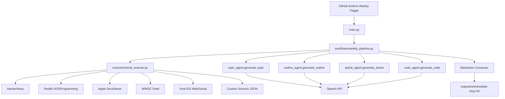

# ios-dev-ai-writer

`ios-dev-ai-writer` is an open-source Python agent pipeline that generates a weekly Medium-style iOS article.
It automatically discovers trend signals, creates a topic, builds an outline, writes the article, generates Swift/SwiftUI code, and saves everything as markdown.

## Features

- Automatic iOS trend discovery from:
  - HackerNews
  - Reddit `r/iOSProgramming`
  - Apple Developer docs/news release feeds
  - WWDC videos feed
  - Viral iOS article/social proxies (Google News RSS queries including Medium/X/LinkedIn/dev.to)
- Trend-grounded topic generation using OpenAI
- Structured Medium article outline generation
- ~1200-word article generation
- Practical Swift/SwiftUI code generation
- Output saved to `outputs/articles/{date}-{slug}.md`
- Optional trend snapshots saved to `outputs/trends/`
- Weekly automation via GitHub Actions (Monday 10:00 UTC)

## Project Structure

```text
ios-dev-ai-writer/
├── agents/
│   ├── topic_agent.py
│   ├── outline_agent.py
│   ├── article_agent.py
│   └── code_agent.py
├── scanners/
│   ├── trend_scanner.py
│   └── custom_trends.json
├── workflows/
│   └── weekly_pipeline.py
├── prompts/
│   ├── topic_prompt.txt
│   ├── outline_prompt.txt
│   ├── article_prompt.txt
│   └── code_prompt.txt
├── outputs/
│   ├── articles/
│   └── trends/
├── .github/workflows/
│   └── weekly.yml
├── requirements.txt
├── config.py
├── main.py
└── README.md
```

## Architecture Diagram



## Setup

1. Clone the repository.
2. Create and activate a Python 3.11 virtual environment.
3. Install dependencies:

```bash
pip install -r requirements.txt
```

4. Set environment variables (or place them in `.env`):

```bash
export OPENAI_API_KEY="your_api_key"
export OPENAI_MODEL="gpt-4.1-mini"                          # optional
export OPENAI_TEMPERATURE="0.7"                             # optional
export TREND_DISCOVERY_ENABLED="true"                       # optional
export TREND_MAX_ITEMS_PER_SOURCE="10"                      # optional
export TREND_HTTP_TIMEOUT_SECONDS="12"                      # optional
export REDDIT_USER_AGENT="ios-dev-ai-writer/1.0"            # optional
export TREND_SOURCES="hackernews,reddit,apple,wwdc,viral,custom" # optional
export CUSTOM_TRENDS_FILE="scanners/custom_trends.json"     # optional
```

## Run Locally

```bash
python main.py
```

Outputs:

- `outputs/articles/YYYY-MM-DD-your-topic-slug.md`
- `outputs/trends/YYYY-MM-DDTHH-MM-SSZ-trend-signals.json` (when trend discovery is enabled)

## Recommended Approach For Adding New Trend Sources

Use a **configuration-first plugin approach**:

1. Add or edit entries in `scanners/custom_trends.json` (no Python changes needed).
2. Keep `TREND_SOURCES` in `.env` to control source order and enable/disable groups.
3. Add Python fetcher code only when a source needs a custom API integration.

### Quick examples

Add LinkedIn discovery query:

```json
{
  "name": "LinkedIn iOS Posts",
  "query": "site:linkedin.com/posts iOS SwiftUI"
}
```

Add custom RSS feed:

```json
{
  "name": "iOS Engineering Blog",
  "url": "https://example.com/ios/feed.xml",
  "ios_filter": true
}
```

Add one manual trend link/topic:

```json
{
  "source": "Manual Link",
  "title": "New SwiftUI Navigation Patterns in Production",
  "url": "https://example.com/article",
  "summary": "Optional context",
  "score": 80
}
```

### When to add code vs config

- Use `custom_trends.json` when the source has RSS, can be queried through Google News, or you want to inject manual links.
- Add Python code in `scanners/trend_scanner.py` when a source requires auth, pagination, or custom ranking logic.

## GitHub Automation

The workflow at `.github/workflows/weekly.yml` runs every Monday at 10:00 UTC.

Workflow steps:

1. Checkout repository
2. Set up Python 3.11
3. Install dependencies
4. Run `python main.py`
5. Commit and push new article in `outputs/articles/`

Required repository secret:

- `OPENAI_API_KEY`

## Example Generated Article (excerpt)

````markdown
# Building Production-Ready AI Features in SwiftUI with Structured Concurrency

## Trend Signals (Auto-Discovered)
- [HackerNews] Apple opens new Swift build optimization docs - https://...
- [LinkedIn iOS Posts] Senior iOS Dev shares scalable async architecture pattern - https://...

## Outline
- Why hybrid on-device + cloud AI patterns matter in 2026
- Architecture for prompt orchestration and cancellation
- Concurrency-safe UI state with structured tasks

## Article
Modern iOS teams are no longer asking whether to integrate AI, but how to do it without latency spikes,
unbounded token costs, or UI race conditions.

## Code Example
```swift
@MainActor
final class AIWriterViewModel: ObservableObject {
    @Published var article: String = ""
    private var task: Task<Void, Never>?

    func generate() {
        task?.cancel()
        task = Task {
            // ...
        }
    }
}
```
````

## License

MIT (recommended for open-source use; add a `LICENSE` file if needed).
