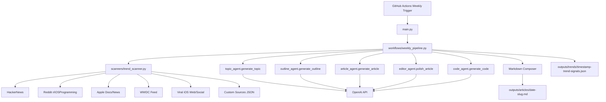

# ios-dev-ai-writer ✍️📱


## 🚀 About
`ios-dev-ai-writer` is an open-source Python agent pipeline that generates weekly Medium-style iOS articles.
It discovers trends, creates a topic, builds an outline, writes the article body, generates Swift/SwiftUI code, and saves markdown output automatically.

## ✨ Features
- Automatic iOS trend discovery from:
  - HackerNews
  - Reddit `r/iOSProgramming`
  - Apple Developer docs/news release feeds
  - WWDC videos feed
  - Broader web/social sources including `x.com`, `dev.to`, and `medium.com` (query + RSS coverage)
- Priority topic interests for upcoming posts:
  - AI, AI Agents, AI Automation
  - Agentic AI and agentic workflows
  - Generative AI in Apple platform apps
- Flexible topic composition modes: iOS-only, AI-only, or hybrid
- Trend-grounded topic generation using OpenAI
- Structured Medium article outline generation
- Professional Medium-style article generation (~900-1200 words)
- Built-in editor pass for quality, tone, and readability
- URL-safety guardrails (body text strips unverified links)
- Anti-repetition topic selection using recent article history
- Practical Swift/SwiftUI code generation
- Output saved to `outputs/articles/{date}-{slug}.md`
- Trend snapshots saved to `outputs/trends/`
- Weekly GitHub Actions automation (Monday 10:00 UTC)

## 🧱 Project Structure
```text
ios-dev-ai-writer/
├── agents/
│   ├── topic_agent.py
│   ├── outline_agent.py
│   ├── article_agent.py
│   ├── editor_agent.py
│   └── code_agent.py
├── scanners/
│   ├── trend_scanner.py
│   └── custom_trends.json
├── workflows/
│   └── weekly_pipeline.py
├── prompts/
│   ├── topic_prompt.txt
│   ├── outline_prompt.txt
│   ├── article_prompt.txt
│   ├── editor_prompt.txt
│   └── code_prompt.txt
├── outputs/
│   ├── articles/
│   └── trends/
├── .github/workflows/
│   ├── weekly.yml
│   └── release.yml
├── VERSION
├── CHANGELOG.md
├── LICENSE
├── requirements.txt
├── pyproject.toml
├── config.py
├── main.py
└── README.md
```

## 🧭 Architecture Diagram


## ⚙️ Setup
1. Clone the repository.
2. Create and activate a Python 3.11 virtual environment.
3. Install dependencies:
```bash
pip install -r requirements.txt
```
4. Configure environment variables (or `.env`):
```bash
export OPENAI_API_KEY="your_api_key"
export OPENAI_MODEL="gpt-4.1-mini"                                # optional
export OPENAI_TEMPERATURE="0.7"                                   # optional
export TREND_DISCOVERY_ENABLED="true"                             # optional
export TREND_MAX_ITEMS_PER_SOURCE="10"                            # optional
export TREND_HTTP_TIMEOUT_SECONDS="12"                            # optional
export REDDIT_USER_AGENT="ios-dev-ai-writer/1.0"                  # optional
export TREND_SOURCES="hackernews,reddit,apple,wwdc,viral,social,platforms,custom"  # optional
export CUSTOM_TRENDS_FILE="scanners/custom_trends.json"           # optional
export EDITOR_PASS_ENABLED="true"                                  # optional
export TOPIC_INTERESTS="AI,AI Agents,AI Automation,Agentic AI,Agentic workflows,Generative AI"  # optional
export TOPIC_MODE="balanced"                                       # optional: balanced|ios_only|ai_only|hybrid
```

## ▶️ Run Locally
```bash
python main.py
```

Generated outputs:
- `outputs/articles/YYYY-MM-DD-your-topic-slug.md`
- `outputs/trends/YYYY-MM-DDTHH-MM-SSZ-trend-signals.json`

## 🔌 Add New Trend Sources (Recommended)
Use a config-first workflow:
1. Add/edit entries in `scanners/custom_trends.json`.
2. Keep `TREND_SOURCES` in `.env` to enable/disable source groups.
3. Only add Python fetcher code when a source needs custom API/auth logic.

LinkedIn query example:
```json
{
  "name": "LinkedIn iOS Posts",
  "query": "site:linkedin.com/posts iOS SwiftUI"
}
```

## 🏷️ Versioning
- Current version: `0.1.3` (see `VERSION`)
- Versioning scheme: Semantic Versioning (`MAJOR.MINOR.PATCH`)
- Release notes source: `CHANGELOG.md`

### Release process
1. Update `VERSION` and `CHANGELOG.md`.
2. Commit changes.
3. Create and push a version tag:
```bash
git tag v0.1.4
git push origin v0.1.4
```
4. GitHub Action `.github/workflows/release.yml` creates a GitHub Release automatically.

## 🤖 GitHub Automation
The workflow `.github/workflows/weekly.yml` runs every Monday at 10:00 UTC.

Workflow steps:
1. Checkout repository
2. Set up Python 3.11
3. Install dependencies
4. Run `python main.py`
5. Commit and push generated content from:
   - `outputs/articles/`
   - `outputs/trends/`

Required repository secret:
- `OPENAI_API_KEY`

## 📄 License
MIT License. See `LICENSE`.
