# ios-dev-ai-writer ✍️📱


## 🚀 About
`ios-dev-ai-writer` is an open-source Python agent pipeline that generates weekly Medium-style Apple-platform engineering articles.
It discovers trends, creates a topic, builds an outline, writes the article body, generates Swift/SwiftUI code, creates a LinkedIn promo post, assembles a weekly developer newsletter, and saves output automatically.

## ✨ Features
- Automatic iOS trend discovery from:
  - HackerNews
  - Reddit `r/iOSProgramming`
  - Apple Developer docs/news release feeds
  - WWDC videos feed
  - Broader web/social sources including `x.com`, `dev.to`, and `medium.com` (query + RSS coverage)
- Priority topic interests for upcoming posts:
  - Swift async/await, Structured Concurrency, Swift 6.3 Macros
  - iOS performance architecture, and boilerplate reduction patterns
  - Apple-platform APIs like App Intents, Apple Intelligence APIs, and WidgetKit
- Apple ecosystem programming-only topic generation (no AI-first topic modes)
- Trend-grounded topic generation using OpenAI
- Structured Medium article outline generation
- Professional Medium-style article generation (~900-1200 words)
- Built-in editor pass for quality, tone, and readability
- Reinforcement-style layout repair loop for Medium formatting consistency
- URL-safety guardrails (body text strips unverified links)
- Semantic anti-repetition topic deduplication using embedding-based cosine similarity (`text-embedding-3-small`) to catch near-duplicate topics that share few lexical tokens
- Post-generation self-review agent scores each article on overall quality, technical depth, and actionability via a dedicated LLM pass
- Persistent quality history (`outputs/quality_history.json`) accumulating per-run layout scores, code repair counts, and review scores for trend analysis across runs
- Practical Swift/SwiftUI code generation
- Swift 6 Observation-first code generation (`@Observable` preferred over legacy wrappers)
- Swift version targeting for generated snippets (default: Swift 6.2.4, compiler mode 6)
- Senior, architecture-focused LinkedIn post generation with claim guardrails
- Trust-first reference publication from vetted technical domains
- Code generation observability metadata (`direct|repaired|omitted` path + repair attempts)
- Snippet-safe code validation mode with Swift-book-guided typo/unknown-symbol repairs
- **Weekly newsletter assembly** — SwiftTribune-style developer newsletter with six sections (Opening hook, This Week's Big Story, Trend Signals, Swift Snippet of the Week, Community Picks, Closing CTA), output as both Markdown and email-safe HTML (inline styles, max-width 600px). Issue number auto-increments across runs.
- **Google Imagen 3 cover image generation** — each run generates a 16:9 abstract tech illustration for the article topic using Google Imagen 3. Saved to `outputs/images/` and referenced via YAML frontmatter (`cover_image: images/...`) in the article markdown.
- Structured JSON logging for local runs and GitHub Actions (`agent_name`, token usage, timing, step status)
- Output generated locally to `outputs/` (gitignored) and auto-published to [`saurabhdave/ios-ai-articles`](https://github.com/saurabhdave/ios-ai-articles):
  - `outputs/articles/{date}-{slug}.md`
  - `outputs/trends/{timestamp}-trend-signals.json`
  - `outputs/linkedin/{date}-{slug}-linkedin.md`
  - `outputs/codegen/{date}-{slug}-codegen.json`
  - `outputs/newsletter/{date}-issue-N.md`
  - `outputs/newsletter/{date}-issue-N.html`
  - `outputs/images/{date}-{slug}.png`
  - `outputs/quality_history.json` (append-only quality record per run)
- GitHub Actions automation 2 days/week (Monday and Thursday at 10:00 UTC)

## 🧱 Project Structure
```text
ios-dev-ai-writer/
├── agents/
│   ├── topic_agent.py
│   ├── outline_agent.py
│   ├── article_agent.py
│   ├── editor_agent.py
│   ├── code_agent.py
│   ├── image_agent.py
│   ├── linkedin_agent.py
│   ├── newsletter_agent.py
│   └── review_agent.py
├── scanners/
│   ├── trend_scanner.py
│   └── custom_trends.json
├── workflows/
│   └── weekly_pipeline.py
├── prompts/
│   ├── topic_prompt.txt
│   ├── outline_prompt.txt
│   ├── article_prompt.txt
│   ├── article_factuality_prompt.txt
│   ├── editor_prompt.txt
│   ├── layout_repair_prompt.txt
│   ├── code_prompt.txt
│   ├── linkedin_prompt.txt
│   ├── linkedin_factuality_prompt.txt
│   ├── newsletter_prompt.txt
│   └── review_prompt.txt
├── outputs/                  # gitignored — published to ios-ai-articles
│   ├── articles/
│   ├── trends/
│   ├── linkedin/
│   ├── codegen/
│   ├── images/
│   ├── newsletter/
│   └── quality_history.json
├── ios-ai-articles/          # seed config for content repo
│   └── _config.yml
├── .github/workflows/
│   ├── weekly.yml
│   └── release.yml
├── CLAUDE.md
├── VERSION
├── CHANGELOG.md
├── LICENSE
├── pyproject.toml
├── config.py
├── main.py
└── README.md
```

## 🧭 Architecture Diagram

```mermaid
flowchart TD
    A[GitHub Actions Scheduled Trigger 3x per week] --> B[main.py]
    B --> C[workflows/weekly_pipeline.py]
    C --> S[scanners/trend_scanner.py]
    S --> S1[HackerNews]
    S --> S2[Reddit r/iOSProgramming]
    S --> S3[Apple Docs/News]
    S --> S4[WWDC Feed]
    S --> S5[Viral iOS Web/Social]
    S --> S6[Custom Sources JSON]
    C --> D[topic_agent.generate_topic]
    C --> E[outline_agent.generate_outline]
    C --> F[article_agent.generate_article]
    C --> G[editor_agent.polish_article]
    C --> IMG[image_agent.generate_cover_image]
    C --> H[code_agent.generate_code]
    C --> L[linkedin_agent.generate_linkedin_post]
    C --> NL[newsletter_agent.generate_newsletter]
    C --> R[review_agent.review_article]
    D --> API[OpenAI API]
    E --> API
    F --> API
    G --> API
    H --> API
    L --> API
    NL --> API
    R --> API
    IMG --> GAPI[Google Imagen 3 API]
    C --> I[Markdown Composer]
    I --> J[outputs/articles/date-slug.md]
    C --> K[outputs/trends/timestamp-trend-signals.json]
    C --> M[outputs/linkedin/date-slug-linkedin.md]
    C --> N[outputs/codegen/date-slug-codegen.json]
    IMG --> IM[outputs/images/date-slug.png]
    NL --> NW[outputs/newsletter/date-issue-N.md + .html]
    R --> O[outputs/quality_history.json]
    J --> P[saurabhdave/ios-ai-articles]
    M --> P
    N --> P
    NW --> P
    IM --> P
```


## ⚙️ Setup
1. Clone the repository.
2. Create and activate a Python 3.11 virtual environment.
3. Install dependencies:
```bash
pip install -e .
```
4. Configure environment variables (or `.env`):
```bash
export OPENAI_API_KEY="your_api_key"
export OPENAI_MODEL="gpt-5-mini"                                  # optional
export OPENAI_TEMPERATURE="0.7"                                   # optional
export OPENAI_REASONING_EFFORT="low"                              # optional: minimal|low|medium|high (used for gpt-5*)
export TREND_DISCOVERY_ENABLED="true"                             # optional
export TREND_MAX_ITEMS_PER_SOURCE="10"                            # optional
export TREND_HTTP_TIMEOUT_SECONDS="12"                            # optional
export REDDIT_USER_AGENT="ios-dev-ai-writer/1.0"                  # optional
export TREND_SOURCES="hackernews,reddit,apple,wwdc,viral,social,platforms,custom"  # optional
export CUSTOM_TRENDS_FILE="scanners/custom_trends.json"           # optional
export EDITOR_PASS_ENABLED="true"                                  # optional
export MEDIUM_LAYOUT_REINFORCEMENT_ENABLED="true"                  # optional
export MEDIUM_LAYOUT_MAX_REPAIR_PASSES="2"                         # optional
export MEDIUM_LAYOUT_MIN_SCORE="8"                                 # optional
export FACT_GROUNDING_ENABLED="true"                               # optional
export FACT_GROUNDING_MAX_PASSES="1"                               # optional
export TOPIC_INTERESTS="Swift async await patterns,Structured Concurrency,SwiftUI architecture,iOS performance improvements,Xcode tips and debugging workflows,UIKit interoperability,SwiftData persistence,App Intents,Apple Intelligence APIs,WidgetKit,verified Swift tips and tricks,verified SwiftUI modifiers,Swift 6.3 Macros,Reducing Boilerplate in Real Projects,visionOS development,Swift 6 migration and strict concurrency,Deprecated Apple API migration playbooks,Legacy UIKit patterns to modern SwiftUI"  # optional
export TOPIC_MODE="ios_only"                                       # optional; normalized to ios_only
export LINKEDIN_POST_ENABLED="true"                                # optional
export LINKEDIN_CODE_SNIPPET_MODE="auto"                           # optional: auto|always|never
export NEWSLETTER_ENABLED="true"                                   # optional
export NEWSLETTER_NAME="iOS Dev Weekly"                            # optional
export NEWSLETTER_ISSUE_FILE="outputs/newsletter/.issue_number"    # optional: persistent issue counter
export SWIFT_LANGUAGE_VERSION="6.2.4"                              # optional
export SWIFT_COMPILER_LANGUAGE_MODE="6"                            # optional; maps to swiftc -swift-version
export CODEGEN_FAILURE_MODE="omit"                                 # optional: omit|error
export CODEGEN_VALIDATION_MODE="snippet"                           # optional: snippet|compile|none
export SELF_REVIEW_ENABLED="true"                                  # optional: run LLM self-review after generation
export OUTPUT_QUALITY_HISTORY_PATH="outputs/quality_history.json"  # optional: path for per-run quality metrics
export PIPELINE_LOG_LEVEL="INFO"                                   # optional: DEBUG|INFO|WARNING|ERROR
export GOOGLE_API_KEY="your_google_api_key"                        # optional: enables Imagen 3 cover image generation
export IMAGE_GENERATION_ENABLED="true"                             # optional: set to false to skip image generation
export IMAGEN_MODEL="gemini-2.5-flash-image"                       # optional: Gemini image model (default) or imagen-4.0-generate-001 (requires paid plan)
```

## ▶️ Run Locally
```bash
python main.py
```

The CLI emits structured JSON log lines to stdout so GitHub Actions logs show pipeline steps, agent calls, token usage, and elapsed time.

Generated outputs (written to `outputs/` locally — gitignored, not committed to this repo):
- `outputs/articles/YYYY-MM-DD-your-topic-slug.md`
- `outputs/trends/YYYY-MM-DDTHH-MM-SSZ-trend-signals.json`
- `outputs/linkedin/YYYY-MM-DD-your-topic-slug-linkedin.md`
- `outputs/codegen/YYYY-MM-DD-your-topic-slug-codegen.json`
- `outputs/newsletter/YYYY-MM-DD-issue-N.md`
- `outputs/newsletter/YYYY-MM-DD-issue-N.html`
- `outputs/images/YYYY-MM-DD-your-topic-slug.png`
- `outputs/quality_history.json` (appended each run)

When run via GitHub Actions, all outputs are automatically pushed to [`saurabhdave/ios-ai-articles`](https://github.com/saurabhdave/ios-ai-articles).

## 🔌 Add New Trend Sources (Recommended)
Use a config-first workflow:
1. Add/edit entries in `scanners/custom_trends.json`.
2. Keep `TREND_SOURCES` in `.env` to enable/disable source groups.
3. Only add Python fetcher code when a source needs custom API/auth logic.

LinkedIn query example:
```json
{
  "name": "LinkedIn iOS Posts",
  "query": "site:linkedin.com/posts iOS SwiftUI"
}
```

## 🏷️ Versioning
- Current version: `0.4.0` (see `pyproject.toml` / `VERSION`)
- Versioning scheme: Semantic Versioning (`MAJOR.MINOR.PATCH`)
- Release notes source: `CHANGELOG.md`

### Release process
1. Update `pyproject.toml`, `VERSION`, `CHANGELOG.md`, and `README.md` version badge.
2. Commit changes.
3. Create and push a version tag:
```bash
git tag v0.4.0
git push origin v0.4.0
```
4. GitHub Action `.github/workflows/release.yml` creates a GitHub Release automatically.

## 🤖 GitHub Automation
The workflow `.github/workflows/weekly.yml` runs every Monday and Thursday at 10:00 UTC.

Workflow steps:
1. Checkout repository
2. Set up Python 3.11
3. Install dependencies (`openai`, `google-generativeai`, and others)
4. Run `python main.py`
5. Publish `outputs/articles/`, `outputs/linkedin/`, `outputs/codegen/`, `outputs/newsletter/`, and `outputs/images/` to [`saurabhdave/ios-ai-articles`](https://github.com/saurabhdave/ios-ai-articles) via `DEPLOY_TOKEN`
6. Commit and push any remaining changes (e.g. `outputs/trends/`) to this repo

Required repository secrets:
- `OPENAI_API_KEY`
- `DEPLOY_TOKEN` — GitHub PAT with `contents: write` on `saurabhdave/ios-ai-articles`
- `GOOGLE_API_KEY` — Google AI Studio API key for Imagen 3 cover image generation

## 📄 License
MIT License. See `LICENSE`.
